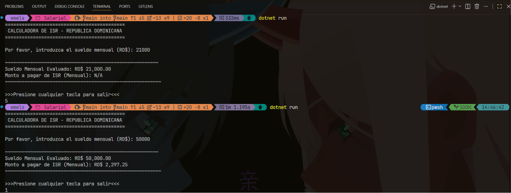
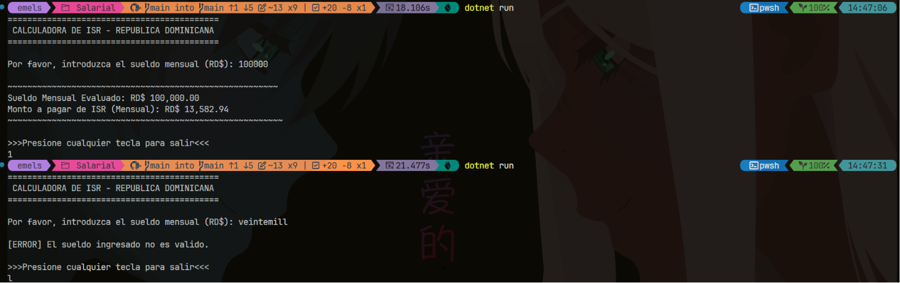

+++Calculadora de ISE (Republica Dominicana - 2026)

Este programa de consola desarrollado en C# automatiza el calculo del impuesto sobre la renta (ISR) para empleados
de RD, bajo las normativas y escalas salariales vigentes de la DGII para el año 2026.

+++Caracteristicas:

+>Precision Financiera: Utiliza el tipo de dato 'decimal' para evitar errores de redondeo en operacions monetarias.
+>Procesamiento Progresivo: Evalua los ingresos de forma anualizada aplicando de manera exacta los excedentes y tasas fijas correspondientes a cada tramo de la ley.
+>Validacion de Entradas: Implementa 'decimal.TryParse' para asegurar la estabilidad del programa ante datos no validos.
+>Formato Limpio: Salida formateada con configuraciones regionales estandar ('InvariantCulture') para una correcta lectura de valores numericos en la consola.

+++Escala de Retencion Aplicada:
El sistema calcula el ISR en base a los siguientes tramos anuales:

1. Exento: Hasta RD$ 416,220.00 (Muesta 'N/A' en pantalla).
2. tramo 1: 15% del excedente de RD$ 416,220.01. 
3. tramo 2: RD$ 31,216.00 mas el 20% del excedente de RD$ 624,329.01
4. tramo 3: RD$ 79,776.00 mas el 25% del excedente de RD$ 867,123.01.

+++Tecnologias Utilizadas:

Lenguaje: C#
Plataforma: .NET Core / .NET SDK
Entorno recomendado: JetBrains Rider o VS Code

+++Imagenen 1:

+++Imagen 2:
